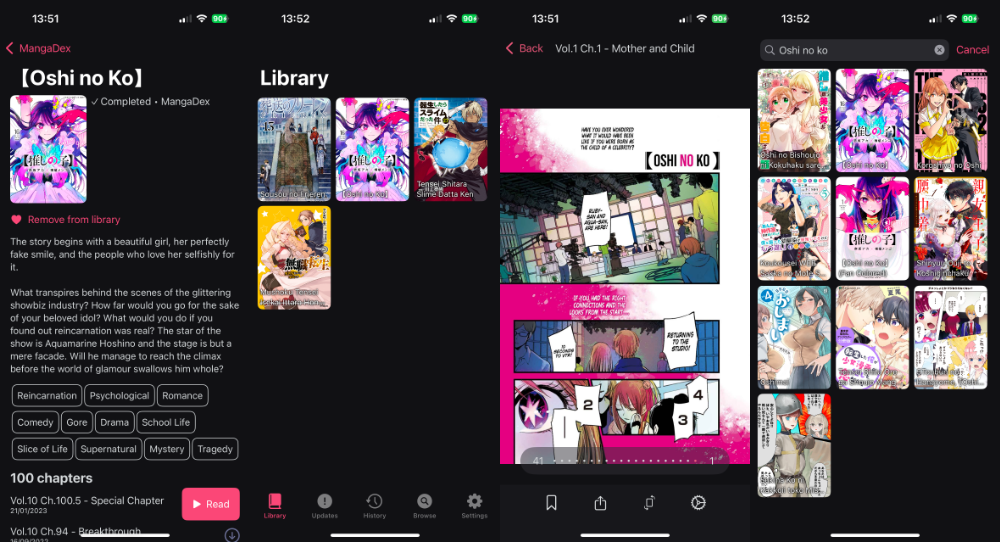

# Mango Manga

> Simple manga app with support for multiple sources inspired by tachiyomi

### Should you use this?
probably not yet

## Screenshots

## Installing

todo

## Adding support for more sources

- create a new folder in `Mango/Sources/Providers/`
- extend the enums in `Mango/Manga/` and `Mango/Sources/Provider.swift` to support the new source
