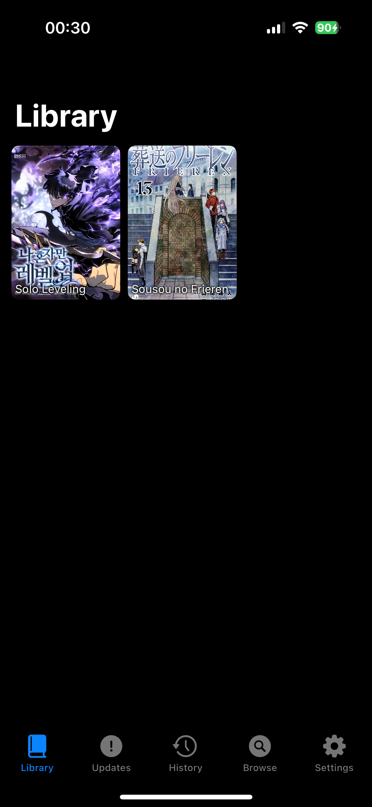
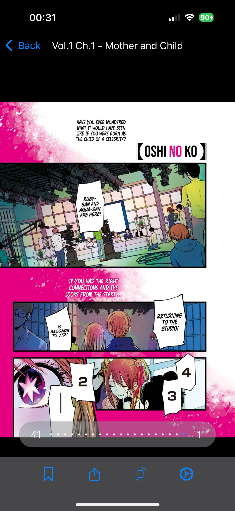

# Manga App

> Simple manga app with support for multiple sources inspired by tachiyomi

### Should you use this?
probably not

## Screenshots

## Installing

todo

## Adding support for more sources

- create a new folder in `MangaApp/Sources/Providers/`
- extend the enums in `MangaApp/Manga/` and `MangaApp/Sources/Provider.swift` to support the new source